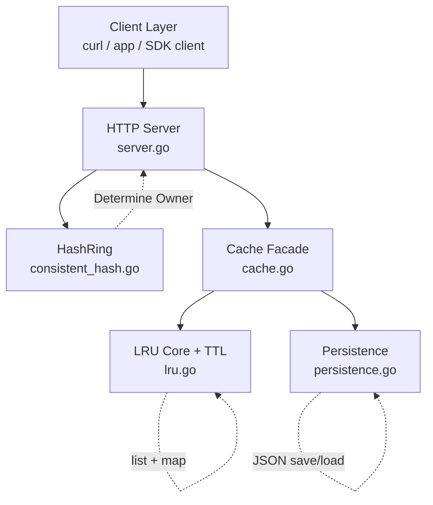
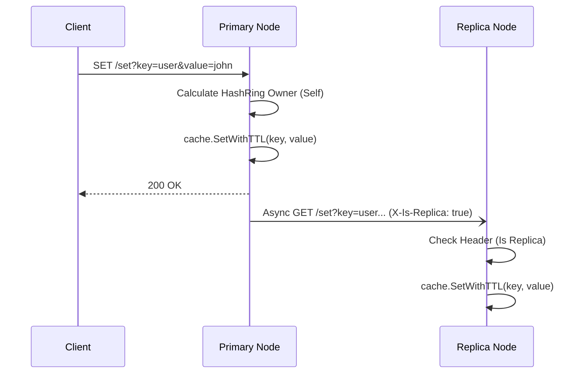

# Distributed Cache System (Go)

A Redis-inspired distributed cache project built to learn real backend engineering: cache design, TTL semantics, HTTP APIs, persistence, hashing for sharding, and production packaging with Docker.

## Why This Project

This repository is designed as a learning-to-production journey:
- Start with core cache operations (`GET`, `SET`) and LRU eviction.
- Add reliability features (TTL + save/load persistence).
- Add distribution primitives (consistent hashing + replica forwarding).
- Ship it like a real service using Docker and Compose.

## High-Level Features

- In-memory LRU cache with `O(1)` average read/write operations
- Per-key TTL support
- HTTP API server (`/get`, `/set`, `/save`, `/load`)
- Snapshot persistence to disk (`cache.json`)
- Consistent hash client for key-to-node routing
- Dockerized deployment (non-root container + healthcheck)

## Architecture Graph



## Request Flow Graph



## Data Structure Design

LRU is implemented using:
- Hash map: key -> list node pointer (fast lookup)
- Doubly linked list: recency order (fast move/eviction)

Complexity summary:
- `GET`: `O(1)` average
- `SET`: `O(1)` average
- Eviction: `O(1)`

## API Reference

| Endpoint | Method | Query Params | Purpose |
|---|---|---|---|
| `/` | GET | - | Health/info text |
| `/set` | GET | `key`, `value`, optional `ttl` | Write key/value |
| `/get` | GET | `key` | Read value |
| `/save` | GET | optional `file` | Snapshot to disk |
| `/load` | GET | optional `file` | Restore snapshot |

Quick examples:
```bash
curl "http://localhost:8000/set?key=user&value=john"
curl "http://localhost:8000/get?key=user"
curl "http://localhost:8000/set?key=temp&value=123&ttl=60"
curl "http://localhost:8000/save?file=cache.json"
curl "http://localhost:8000/load?file=cache.json"
```

## Docker Deployment

Build image:
```bash
docker build -t distributed-cache:latest .
```

Run container:
```bash
docker run --rm -p 8000:8000 distributed-cache:latest
```

Compose:
```bash
docker compose up --build
```

Production-minded container choices already applied:
- Non-root runtime user
- Healthcheck configured
- Restart policy in Compose (`unless-stopped`)
- Alpine 3.21 runtime base

## Observed Runtime Snapshot (Docker Desktop)

From your running container screenshot:
- CPU usage: near `0%` at idle
- Memory usage: about `2.07 MB`
- Disk I/O: low and bursty (expected for light traffic)
- Network I/O: tiny, request-driven traffic

Interpretation:
- Current implementation is lightweight and efficient for small workloads.
- Real stress testing is still needed for throughput/latency confidence.

## What I Learned Building This

- Why list + map is the practical LRU pattern for `O(1)` operations
- TTL is not just storage, it affects read-path correctness and eviction behavior
- Persistence introduces state lifecycle concerns (startup, crash recovery)
- Consistent hashing simplifies horizontal scaling strategy
- Docker hardening matters even for small projects (user, healthchecks, base image hygiene)

## Where To Improve Next (Priority Roadmap)

1. ~~Concurrency safety (Completed)~~
- Added synchronization (`sync.RWMutex`) around shared cache state.
- System is now fully hardened for concurrent writes.

2. Better HTTP semantics
- Use `POST` for writes (`/set`, `/save`, `/load`) instead of `GET`.
- Return consistent JSON response format with status/message fields.

3. Distributed behavior maturity
- Add real node membership + dynamic replica list.
- Add retry/backoff and timeout handling for replica forwarding.

4. Observability
- Add `/metrics` endpoint (Prometheus format).
- Add structured logging (request id, path, latency, status).

5. Performance confidence
- Add benchmark scripts (`hey`, `wrk`, or Go benchmarks).
- Track p50/p95/p99 latency under load.

6. Data durability
- Add periodic snapshots.
- Add write-ahead log (WAL) for crash recovery guarantees.


## Project Structure

```text
.
|-- main.go
|-- Dockerfile
|-- docker-compose.yml
|-- cache/
|   |-- cache.go
|   |-- lru.go
|   `-- persistence.go
|-- server/
|   `-- server.go
|-- hash/
|   `-- consistent_hash.go
`-- client/
    `-- client.go
```

## Local Development

Prerequisite:
- Go 1.26+

Run:
```bash
go run main.go -port 8000 -capacity 100
```

## Notes

- Keys without `ttl` are treated as non-expiring.
- `GET /get` returns `404` for missing or expired keys.
- Persistence file defaults to `cache.json`.
